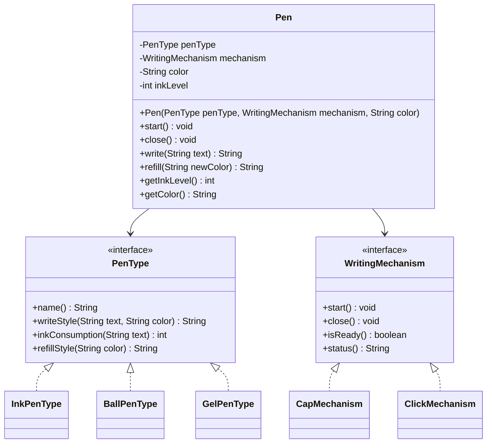

# Pen System - UML (Mermaid)

```mermaid
classDiagram
    class Pen {
      -PenType penType
      -WritingMechanism mechanism
      -String color
      -int inkLevel
      +Pen(PenType penType, WritingMechanism mechanism, String color)
      +start() void
      +close() void
      +write(String text) String
      +refill(String newColor) String
      +getInkLevel() int
      +getColor() String
    }

    class PenType {
      <<interface>>
      +name() String
      +writeStyle(String text, String color) String
      +inkConsumption(String text) int
      +refillStyle(String color) String
    }

    class InkPenType
    class BallPenType
    class GelPenType

    class WritingMechanism {
      <<interface>>
      +start() void
      +close() void
      +isReady() boolean
      +status() String
    }

    class CapMechanism
    class ClickMechanism

    Pen --> PenType
    Pen --> WritingMechanism

    PenType <|.. InkPenType
    PenType <|.. BallPenType
    PenType <|.. GelPenType

    WritingMechanism <|.. CapMechanism
    WritingMechanism <|.. ClickMechanism
```

## Notes

- `Pen` keeps color and ink level.
- `PenType` decides how writing and refill behave.
- `WritingMechanism` handles start/close behavior.
